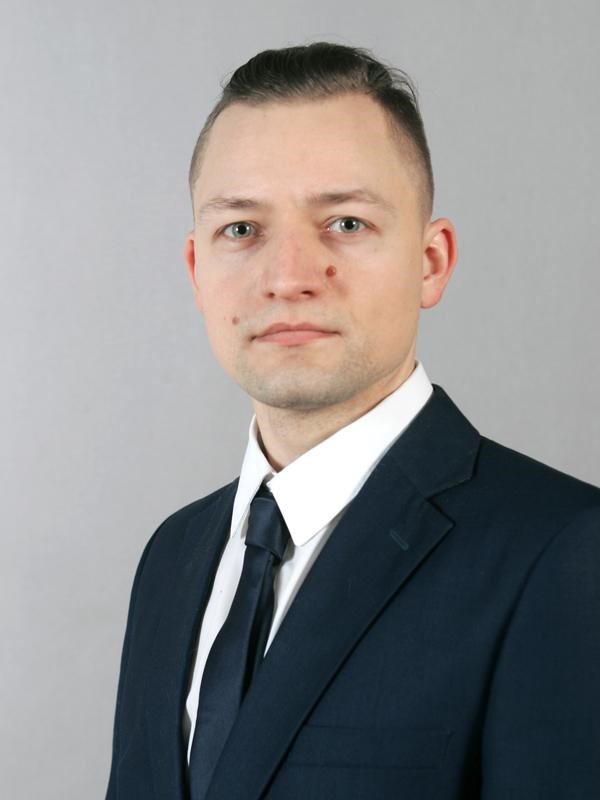

  

Илья Трегуб  
***Python-разработчик***  
тел. +7 (908) 923-58-77  
email: forgotten-devil@mail.ru  
tg: @Volleyboler  
  
  
КЛЮЧЕВЫЕ КОМПЕТЕНЦИИ  
- Формулирование идей продукта
- Написание программного кода на языке Python
- Проектирование реляционных баз данных под требования проекта
- Верстка на HTML и CSS
- Работа с внешними API
- Работа с базами данных
- GIT
- PostgreSQL
- Написание кода с использованием ООП
- Использование принципов KISS, DRY

ПРОФЕССИОНАЛЬНЫЙ ОПЫТ  
- 06.2022 – настоящее время Учебные проекты в Нетологии
- курс Python-разработчик 
- курс Fullstack-разработчик на Python

ОБРАЗОВАНИЕ
- 2015, УрФУ,, специальность «Технология машиностроения», Департамент технологический, специалист
- 2017, ИРИТ РТФ УрФУ, г. Екатеринбург, специальность «Радиотехника», факультет, магистр
 Курсы, тренинги: 
- 2023, Нетология, Python разработчик

Дополнительная информация:
Английский язык - B2

ОБО МНЕ  
Я разработчик Python. В свободное время занимаюсь волейболом.

